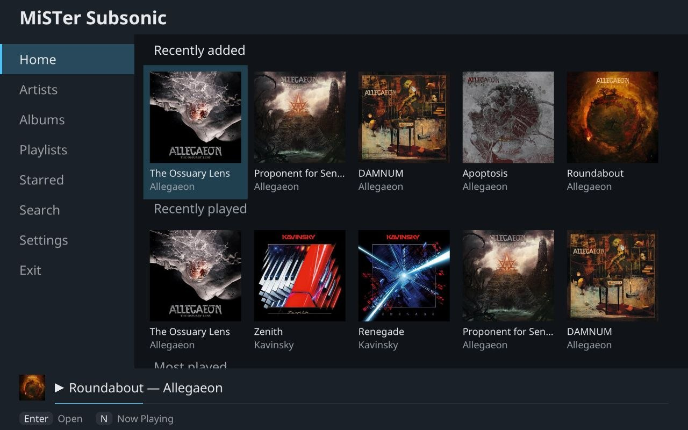
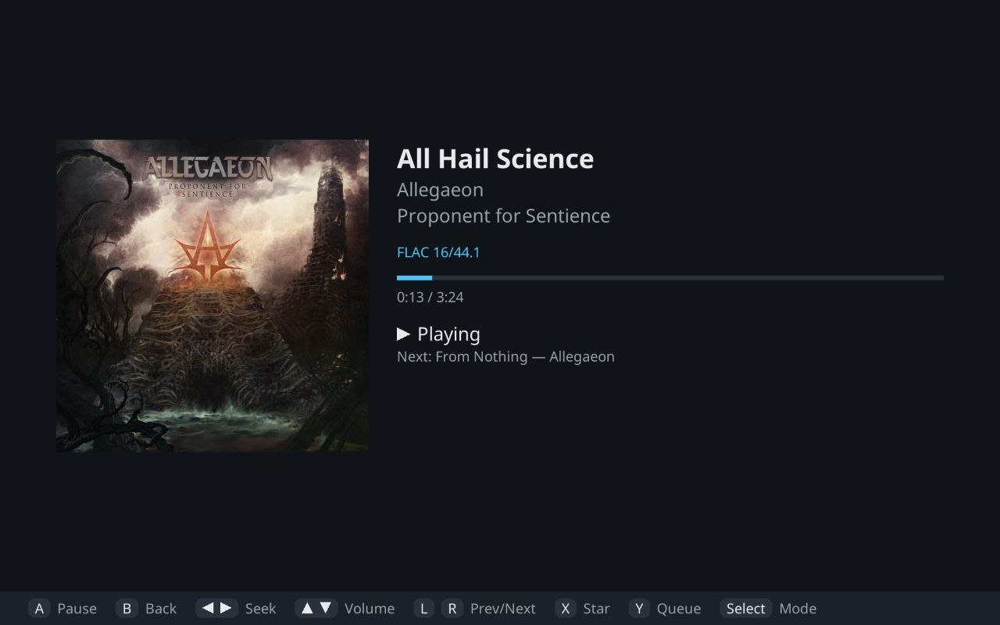
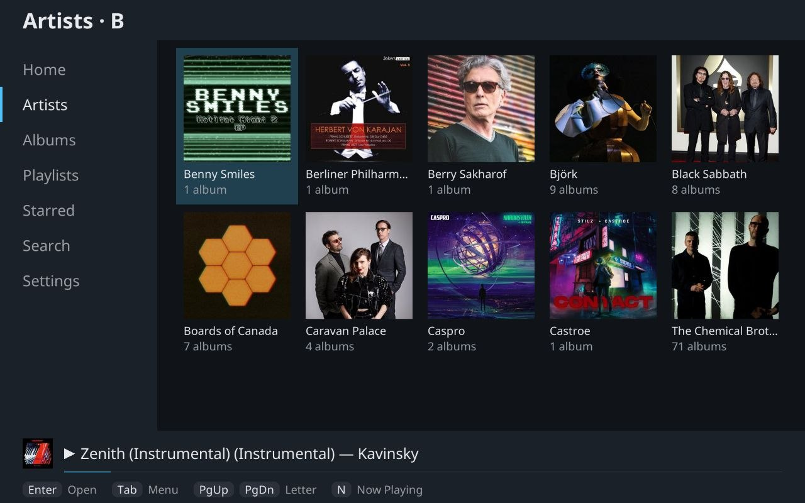
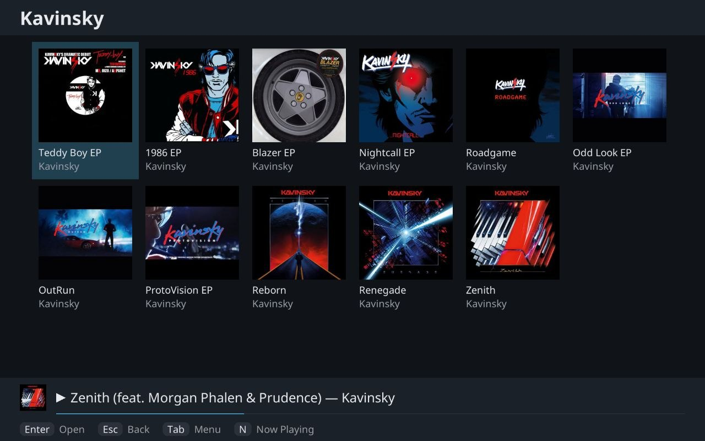
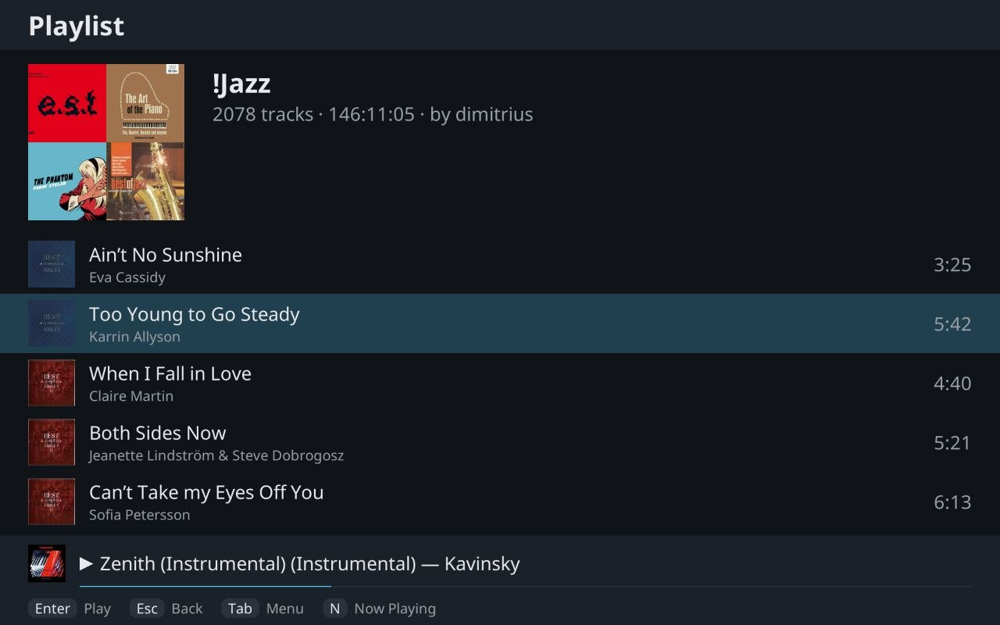
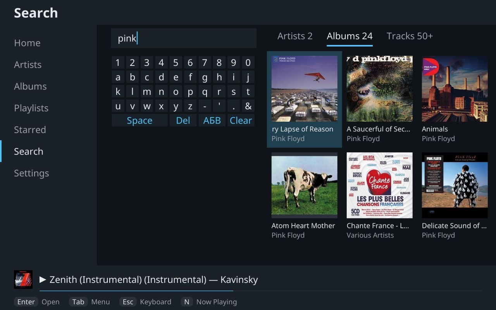

# MiSTer Subsonic

A music player for the [MiSTer FPGA](https://github.com/MiSTer-devel) that streams your library from a Subsonic or Navidrome server.

| | |
|---|---|
|  |  |
|  |  |
|  |  |

## Features

- Home screen with recently added, recently played, most played and random albums
- Artists A to Z, albums by name, year or genre, playlists and starred songs, all with covers
- Search with an on-screen keyboard or a real one
- FLAC, MP3 and WAV with gapless playback and seeking. For other formats the server transcodes to MP3, FLAC or WAV
- ReplayGain (track or album) and scrobbling to Last.fm or ListenBrainz
- Shuffle, repeat, queue 
- Saves the queue and position
- Visualizer in four styles (bars, scope, VU meters, waterfall)
- Web remote: control playback, edit the queue and browse your library from a phone on the same network
- HDMI layout with a sidebar and cover grids, drawn at the TV's full resolution (up to 1920x1200), and a list layout for 15 kHz CRTs
- Media keys on multimedia keyboards work

## Installation

### With Downloader or update_all

Add this to `/media/fat/downloader.ini` and run an update:

```ini
[mistersubsonic]
db_url = https://raw.githubusercontent.com/dimitriuz/misterSubsonic/db/db.json
```

### By hand

Download `MiSTer_Subsonic-<version>.zip` from the releases page and unzip it to the root of the SD card. You get `Scripts/MiSTer_Subsonic.sh` and a `mistersubsonic/` folder.

### First start

Open the Scripts menu and run **MiSTer_Subsonic**. The first time, a setup screen asks for your server address, username and password, checks that they work and saves them. For most servers only a login token is stored, not the password.

To quit, pick Exit in the main menu or hold B on the home screen.

Settings are kept in `/media/fat/mistersubsonic/config.toml`.

### Video

On HDMI it works with the default `MiSTer.ini`.

For a 15 kHz CRT, add a `[Menu]` section to `MiSTer.ini`, for example the 240p mode that SAM uses:

```ini
[Menu]
video_mode=640,16,64,80,240,1,3,14,12380
vga_scaler=1
composite_sync=1
```

With an interlaced mode (480i or 576i), also set `profile = "crt"` under `[display]` in `config.toml`.

For a TV on the component (YPbPr) input, the `[Menu]` section needs `vga_scaler=1` and a `video_mode`. 

If the TV cuts off the edges, use Settings → Display → Overscan to move the picture.

### Web remote

The remote is off by default. Turn it on in Settings → Remote, which also shows the address to open on your phone, something like `http://192.168.1.20:8080`.

It has no password. Anyone on your home network can use it while it's on, so don't forward the port to the internet.

## Building

You need Go 1.26 or newer and [zig 0.16.0](https://ziglang.org/download/). `make release` puts the SD card files and the zip in `bin/release/`.

## License

GPL-3.0. Third-party code and fonts bundled with the app keep their own licenses. The release lists them in `mistersubsonic/THIRD_PARTY.txt`.
